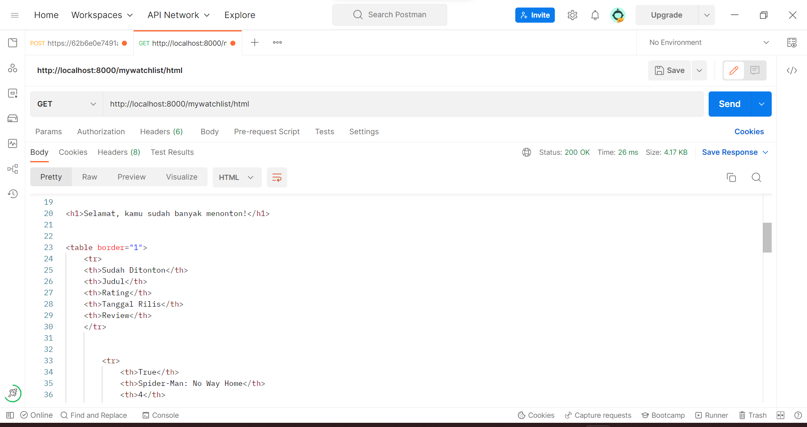
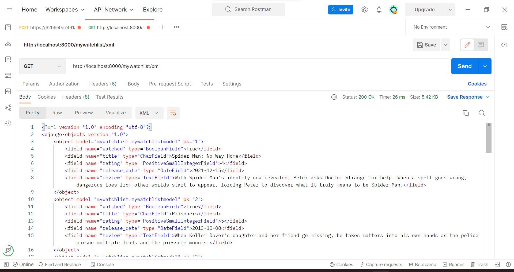
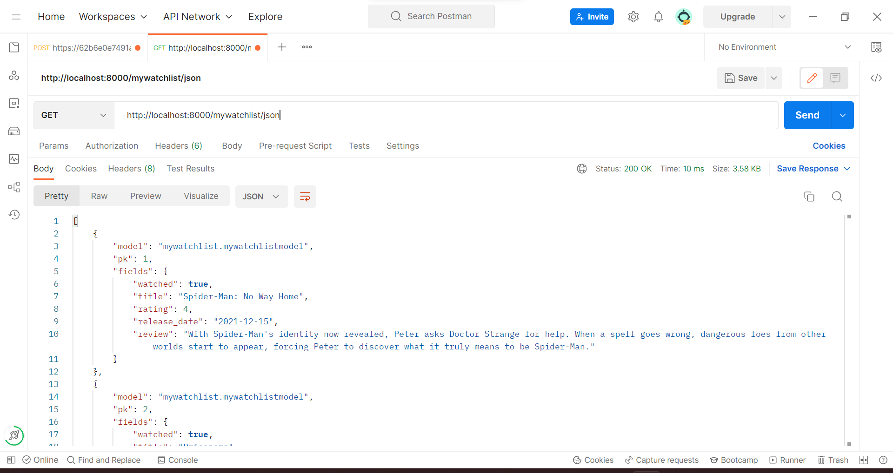

# Tugas 3 Proyek Django PBP

Pemrograman Berbasis Platform (CSGE602022) - diselenggarakan oleh Fakultas Ilmu Komputer Universitas Indonesia, Semester Ganjil 2022/2023

Nama: Fadhlan Hasyim

NPM: 2106652215

Kelas: PBP F

Kode Asdos: BYN

## Pendahuluan

Repositori ini digunakan sebagai wadah untuk mengumpulkan tugas Proyek Django PBP.

## Link Deployment

Aplikasi Heroku yang sudah di-_deploy_ dapat diakses melalui link berikut:
[https://pbp-django-assignments.herokuapp.com/](https://pbp-django-assignments.herokuapp.com/)

## Jawaban Pertanyaan

#### Jelaskan perbedaan antara JSON, XML, dan HTML!

**Jawab:**

JSON (JavaScript Object Notation) pertama kali dikembangkan pada tahun 2001. JSON diturunkan dari bahasa pemrograman JavaScript, tetapi penggunaan untuk membaca dan membuat JSON sudah banyak tersedia di berbagai bahasa pemrograman. JSON digunakan untuk mengirimkan, menyimpan, dan menampilkan data pada platform mobile maupun web. JSON hanya didukung oleh UTF-8 encoding dan tidak mendukung penggunaan komentar. Namun, JSON mendukung penggunaan array di dalamnya. Dewasa ini, penggunaan JSON lebih populer dibandingkan dengan XML berdasarkan data yang dikeluarkan oleh programmableweb.com.

XML (eXtensible Markup Language) pertama kali dikembangkan pada tahun 1997. Serupa dengan JSON, XML juga digunakan pada platform mobile dan web untuk mengirimkan dan menyimpan data. XML diturunkan dari SGML (Standard Generalized Markup Language). Informasi yang dibawa oleh XML disimpan menggunakan tag. XML mendukung penggunaan komen dan berbagai jenis encoding. Sayangnya, XML tidak mendukung penggunaan array seperti JSON. Menurut opini pribadi saya, membaca XML lebih sulit dibandingkan dengan membaca JSON.

HTML (HyperText Markup Language) adalah markup languange yang biasa digunakan dalam pengembangan web. Hal ini dikarenakan HTML mendefinisikan struktur dari suatu halaman web. Sebuah elemen HTML ditandai dengan start tag, content, dan end tag. Berbeda dengan JSON dan XML, fungsi utama HTML adalah untuk menampilkan data. HTML biasa digunakan bersamaan dengan CSS untuk memberikan _styling_.

#### Jelaskan mengapa kita memerlukan _data delivery_ dalam pengimplementasian sebuah platform?

**Jawab:**

Untuk membuat sebuah aplikasi yang dinamis, aplikasi tersebut membutuhkan data. Data tersebut bisa dari berbagai sumber, misalnya dari internet, input user, database, server, dan lain sebagainya. Untuk melakukannya, telah disetujui format dan ketentuan yang dapat digunakan untuk mengirim dan mengambil data sehingga dapat dimengerti baik oleh manusia maupun mesin. Beberapa di antaranya adalah dengan menggunakan JSON, XML, dan HTML. Nantinya, data yang telah diperoleh dapat diolah menjadi sesuatu yang bermanfaat. Misalnya, dapat ditampilkan kepada user, dll.

#### Jelaskan bagaimana cara kamu mengimplementasikan poin 1 sampai dengan 3 di atas.
 
**Jawab:**

Untuk poin 1, saya menggunakan perintah `python manage.py startapp mywatchlist` untuk membuat django app yang bermana `mywatchlist`. 

Untuk poin 2, saya mendaftarkan aplikasi `mywatchlist` pada variabel `INSTALLED_APPS` di `settings.py` dan pada variabel `urlpatterns` di `urls.py` yang berada di project django. Selain itu, untuk menampilkan _views_ yang sesuai dengan _request_, saya juga menambahkan _route_ pada variabel `urlpatterns` di `urls.py` yang berada di folder `mywatchlist`. 

Untuk poin 3, saya membuat model `MywatchlistModel` di `models.py` pada folder `mywatchlist`. Terdapat lima atribut, yakni watched, title, rating, release_date, dan review. Saya menyesuaikan tipe data kelima variabel tersebut sesuai dengan kebutuhannya. Setelah selesai di `models.py`, saya menjalankan perintah `python manage.py makemigrations` dan `python manage.py migrate` untuk melakukan migrasi. _Voila!_ model sudah siap digunakan :D 

### Screenshots Postman

#### Postman HTML

#### Postman XML

#### Postman JSON

